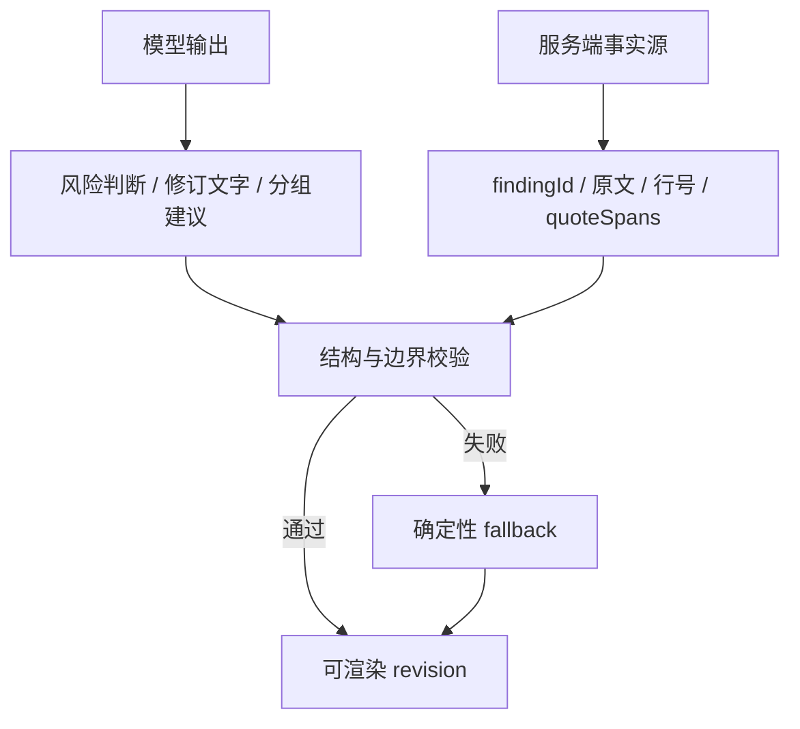

<div align="center">


# 法飞飞 AI · 商业合同智能审查

**面向企业经营者、法务、律师与商务人员的多 Agent 合同风险审查和精细化批注系统**

[](https://react.dev/)
[](https://vite.dev/)
[](https://nodejs.org/)
[](https://expressjs.com/)
[](https://sqlite.org/fts5.html)
[](#许可证)

[在线站点](https://www.flylegal.cn/) · [快速开始](#快速开始) · [系统架构](#系统架构) · [API](#api-接口) · [部署](#生产部署)

</div>

> [!IMPORTANT]
> 本项目输出用于辅助识别合同风险和完善条款，不构成正式法律意见。签署、重大金额、强监管或争议项目应结合完整交易事实，由专业人士复核。

## 项目简介

法飞飞 AI 当前由两部分组成：

- **品牌官网**：产品矩阵、行业解决方案、客户案例、团队介绍与咨询入口；
- **商业合同审查工作台**：上传合同后，依次完成文件解析、结构分析、知识检索、三轮风险审查、问题归并、条款修订和局部批注展示。

合同审查不是一次简单的“把整段交给大模型重写”。系统将模型能力和代码级约束结合：模型负责理解、判断和起草，服务端负责原文定位、跨轮去重、ID 完整性、修订边界和安全回退。最终输出的正文标记与修订卡片按编号一一对应，完整条款默认折叠，便于审阅长合同。

## 核心能力

| 能力 | 说明 |
| --- | --- |
| 多格式文件解析 | 支持 PDF、DOC、DOCX、PNG、JPG、JPEG、WebP；图片通过 OCR 提取文字 |
| 双模型模式 | 快速模式关闭深度推理；深度思考模式使用高推理配置 |
| 三轮增量审查 | 后一轮基于前轮结果补充遗漏，并实时展示每轮新增问题 |
| 双层问题去重 | 提示词约束 + 代码级语义与定位相似度判断，降低换标题、换措辞造成的重复 |
| 混合知识检索 | SQLite FTS5/BM25 为默认检索，可选 Qdrant 向量召回与 SiliconFlow 重排 |
| 可追溯原文定位 | 模型提供最小问题摘录，服务端映射为可信行号与字符区间；定位失败时不猜测 |
| 第四归并 Agent | 三轮审查后按“重复、相关、独立”汇总问题，服务端校验全覆盖、唯一性和目标兼容性 |
| 外科手术式修订 | Agent 同时输出完整修订条款和 `localizedEdits`，页面只标记真正发生变化的局部片段 |
| 编号就近批注 | 正文浅橙标记、编号和对应修订卡一一关联，完整说明和整条修订默认收起 |
| 确定性安全回退 | Agent 输出缺失、越界或不合规时，回退到已验证的 finding 与 quote span，不让错误锚点进入页面 |
| Word 导出 | 导出的 `.doc` 延续页面编号、局部高亮和就近批注结构 |
| 多会话并行 | 每个对话独立维护请求状态；审查可在后台继续，用户可切换或新建会话同时发起其他请求 |
| 本地历史记录 | 对话、审查任务和结构化修订结果保存在浏览器本地存储中 |

## 审查工作流


### 数据可信边界

系统把“模型建议”和“服务端可信事实”分开处理：



主要结构化对象：

- `finding`：风险等级、标题、位置、原文、最小问题子句、字符区间、风险与建议；
- `revision group`：需要在同一修改目标中共同处理的一个或多个 finding；
- `localized edit`：`replace`、`delete` 或 `insert-after` 类型的最小局部编辑；
- `revision`：完整修订条款、局部编辑数组、说明及服务端定位字段。

## 技术栈

| 层级 | 技术 |
| --- | --- |
| Web | React 18、React Router、React Markdown、Lucide React、Framer Motion |
| 构建 | Vite 5、PostCSS、原生 CSS 响应式布局 |
| API | Node.js、Express、Multer、Server-Sent Events |
| 文件解析 | Mammoth、pdf-parse、Tesseract.js、macOS `textutil` / Linux LibreOffice |
| 模型 | OpenAI-compatible Chat Completions 接口；当前默认配置为 DeepSeek 快速/深度模型 |
| 本地知识库 | SQLite、FTS5、条款切分、风险规则抽取、BM25 召回与 RRF 融合 |
| 可选 RAG | Qdrant、BAAI/bge-m3 Embedding、BAAI/bge-reranker-v2-m3 |
| 测试 | Node `assert` 回归脚本、Vite 生产构建、真实浏览器端到端验收 |

## 目录结构

```text
infimind-react/
├── public/                         # 品牌图片、客户 Logo、视频和二维码
├── src/
│   ├── components/                 # 官网展示组件
│   ├── pages/
│   │   ├── HomePage.jsx            # 品牌首页
│   │   ├── AboutPage.jsx           # 关于页面
│   │   └── ContractRewritePage.jsx # 合同审查对话、批注稿、Word 导出
│   ├── utils/                       # 会话请求状态等前端纯函数
│   ├── App.jsx                     # 路由与全局弹窗
│   └── main.jsx                    # React 入口
├── server/
│   ├── agents/                     # 分析、审查、归并、修订 Agent
│   ├── prompts/                    # 四个 Agent 的协议化提示词
│   ├── routes/                     # 合同审查、追问、知识库与账户 API
│   ├── services/                   # 定位、去重、RAG、会话、解析与修订合并
│   ├── scripts/                    # 模板导入、知识库评测、归并回归测试
│   ├── knowledge-base/             # SQLite 数据库、索引及文本模板
│   └── index.js                    # Express 服务入口
├── docs/                           # 产品、架构和部署文档
├── docker-compose.rag.yml          # 可选 Qdrant 服务
├── vite.config.js                  # Vite 与 /api 开发代理
├── .env.example                    # 环境变量模板
└── package.json                    # 脚本与依赖
```

## 快速开始

### 环境要求

- Node.js **24**（仓库提供 `.nvmrc`；Node 22 也可重新安装依赖后运行）
- npm 11+
- macOS、Linux 或 Windows
- 解析旧版 `.doc` 时：
  - macOS 使用系统自带 `textutil`；
  - Linux 需要安装 LibreOffice，并确保 `libreoffice` 或 `soffice` 可执行。
- 使用向量检索时需要 Docker 与 Docker Compose。

> [!WARNING]
> `better-sqlite3` 是原生模块。切换 Node 大版本后必须重新安装或重编译依赖，否则会出现 `NODE_MODULE_VERSION` 不一致。推荐始终先执行 `nvm use` 再安装依赖。

### 1. 获取代码并安装依赖

```bash
git clone git@github.com:spaceyzx216/infimind-react.git
cd infimind-react

nvm install
nvm use
npm ci
```

如果不使用 nvm，请确认 `node -v` 输出 `v24.x`。

### 2. 配置环境变量

```bash
cp .env.example .env.local
```

最小可运行配置：

```dotenv
LOCAL_SERVER_PORT=8789
DEEPSEEK_API_KEY=your_api_key
DEEPSEEK_BASE_URL=https://api.deepseek.com
DEEPSEEK_MODEL=deepseek-v4-pro
DEEPSEEK_FLASH_MODEL=deepseek-v4-flash
JWT_SECRET=replace_with_a_random_32_byte_or_longer_secret
```

`.env.local` 已被 Git 忽略，禁止提交真实密钥。

### 3. 启动前后端

打开两个终端：

```bash
# Terminal 1：Express API，默认 http://localhost:8789
npm run server

# Terminal 2：Vite Web
npm run dev
```

访问：

- 官网：<http://localhost:5173/>
- 合同审查：<http://localhost:5173/contract-rewrite>
- 健康检查：<http://localhost:8789/api/health>

Vite 会把 `/api` 代理到 `LOCAL_SERVER_PORT`，前后端端口必须保持一致。

## 环境变量

### 基础模型与服务

| 变量 | 必需 | 默认值 | 用途 |
| --- | --- | --- | --- |
| `LOCAL_SERVER_PORT` | 否 | `8789` | Express 监听端口，同时供 Vite 开发代理使用 |
| `DEEPSEEK_API_KEY` | 是 | — | 模型调用和账户余额查询密钥，仅服务端读取 |
| `DEEPSEEK_BASE_URL` | 否 | `https://api.deepseek.com` | OpenAI-compatible API 根地址 |
| `DEEPSEEK_MODEL` | 否 | `deepseek-v4-pro` | 深度思考模式模型 |
| `DEEPSEEK_FLASH_MODEL` | 否 | `deepseek-v4-flash` | 快速模式模型 |
| `JWT_SECRET` | 是 | — | 至少 32 字节的随机密钥，用于签发和校验 15 分钟业务 JWT；只能保存在服务端环境变量或 `.env.local` |
| `JWT_ISSUER` | 否 | `fafee-api` | JWT 签发方校验值 |
| `JWT_AUDIENCE` | 否 | `fafee-web` | JWT 受众校验值 |
| `AUTH_ALLOWED_ORIGINS` | 否 | 空 | 生产环境可写刷新 Cookie 的额外浏览器 Origin，逗号分隔 |

### 可选混合 RAG

| 变量 | 默认值 | 用途 |
| --- | --- | --- |
| `RAG_VECTOR_URL` | 空 | Qdrant 地址，例如 `http://localhost:6333`；空值时退化为纯词法检索 |
| `RAG_VECTOR_API_KEY` | 空 | Qdrant API Key |
| `RAG_VECTOR_COLLECTION` | `contract_knowledge_evidence` | 向量集合名 |
| `SILICONFLOW_API_KEY` | 空 | 默认 Embedding 与 Reranker 服务密钥 |
| `RAG_EMBEDDING_URL` | SiliconFlow Embeddings API | 自定义 Embedding 接口 |
| `RAG_EMBEDDING_API_KEY` | 复用 `SILICONFLOW_API_KEY` | 独立 Embedding 密钥 |
| `RAG_EMBEDDING_MODEL` | `BAAI/bge-m3` | Embedding 模型 |
| `RAG_VECTOR_REBUILD_ON_IMPORT` | `false` | 导入模板时是否删除并重建 Qdrant 集合 |
| `RAG_RERANKER_MODE` | `siliconflow` | `siliconflow` 或 `heuristic` |
| `RAG_RERANKER_URL` | SiliconFlow Reranker API | 自定义重排接口 |
| `RAG_RERANKER_API_KEY` | 复用 `SILICONFLOW_API_KEY` | 独立重排密钥 |
| `RAG_RERANKER_MODEL` | `BAAI/bge-reranker-v2-m3` | 重排模型 |

## 知识库与 RAG

### 默认模式：SQLite FTS5

仓库内置 `server/knowledge-base/templates.db`。服务启动时会初始化数据库并加载索引；即使没有 Qdrant 或 SiliconFlow 配置，仍可通过 FTS5/BM25 检索条款和风险规则。

检查状态：

```bash
curl http://localhost:8789/api/knowledge-base/status
```

### 可选模式：Qdrant 混合检索

```bash
docker compose -f docker-compose.rag.yml up -d
```

在 `.env.local` 中配置：

```dotenv
RAG_VECTOR_URL=http://localhost:6333
SILICONFLOW_API_KEY=your_siliconflow_key
RAG_VECTOR_REBUILD_ON_IMPORT=true
```

重新导入素材并同步向量索引：

```bash
npm run import:templates -- "/absolute/path/to/contracts"
```

> [!CAUTION]
> `import:templates` 会把指定素材目录作为权威来源，重建 SQLite 模板、条款、风险规则、评测集和索引文件。请先确认素材目录完整，并备份现有知识库。

运行离线检索评测：

```bash
npm run evaluate:knowledge-base
```

评测报告写入 `server/knowledge-base/evaluation-report.json`，该文件默认不提交。

## API 接口

| 方法 | 路径 | 类型 | 说明 |
| --- | --- | --- | --- |
| `GET` | `/api/health` | JSON | 服务健康检查 |
| `POST` | `/api/auth/register` | JSON | 使用一次性邀请码注册用户名、邮箱和密码 |
| `POST` | `/api/auth/login` | JSON | 使用用户名或邮箱登录，返回 15 分钟 JWT，并写入 7 天 HttpOnly 刷新 Cookie |
| `POST` | `/api/auth/refresh` | JSON | 使用刷新 Cookie 换取新的 JWT，不延长 7 天绝对期限 |
| `GET` | `/api/auth/me` | JSON | 使用 `Authorization: Bearer <JWT>` 查询当前登录用户 |
| `POST` | `/api/auth/logout` | JSON | 撤销刷新令牌并清理 Cookie；已签发 JWT 会在到期前自然失效 |
| `GET` | `/api/account/balance` | JSON | 从服务端查询当前模型账户余额 |
| `GET` | `/api/knowledge-base/templates` | JSON | 返回可参与检索的模板元数据，不返回合同正文 |
| `GET` | `/api/knowledge-base/status` | JSON | 返回文档、条款、风险规则、向量与重排器状态 |
| `POST` | `/api/contract-chat` | SSE | 无附件的合同相关追问对话 |
| `POST` | `/api/contract-rewrite` | SSE | 上传合同并执行完整审查与修订流水线 |
| `POST` | `/api/contract-finalize` | SSE | 根据服务端会话中选中的 finding 生成修订稿；当前前端主流程未调用 |

除健康检查和 `/api/auth/*` 外，所有 `/api` 接口都要求有效的 `Authorization: Bearer <JWT>`；未登录返回 `401`。
`/api/auth/login`、`/api/auth/refresh`、`/api/auth/logout` 还要求 `X-Fafee-Auth: 1`，并拒绝未配置的跨站 Origin，避免浏览器跨站写入刷新 Cookie。
工作台会为每个浏览器生成稳定的 `X-Client-ID` 请求头，并在请求体中携带
`threadId`。前端按 `threadId` 隔离加载、阶段和错误状态，因此不同会话可以并行；
服务端的 ReviewSession 以真实用户 ID 作为归属校验，`X-Client-ID` 只用于辅助运行状态隔离，
不替代登录鉴权。

### `POST /api/contract-rewrite`

请求为 `multipart/form-data`：

| 字段 | 类型 | 说明 |
| --- | --- | --- |
| `files` | File[] | 1～6 个文件，单文件不超过 80 MB |
| `message` | string | 用户特别关注的审查重点，可为空 |
| `mode` | `fast` \| `thinking` | 快速或深度思考模式 |
| `threadId` | string | 浏览器当前对话 ID，用于请求追踪与前端并发隔离 |

服务端会拒绝超过 60,000 字符的合并合同正文。常用 SSE 事件：

| 事件 | 用途 |
| --- | --- |
| `stage.start` / `stage.progress` / `stage.complete` | 阶段状态与进度 |
| `analysis.delta` | Agent 1 结构分析增量文本 |
| `review.round` | 三轮审查的开始、结束和新增问题快照 |
| `review.delta` | 归并后的最终审查报告 |
| `templates.found` | 本次检索命中的证据元数据 |
| `review.original` | 原文与可信 ReviewSession 摘要 |
| `rewrite.result` | 结构化 revisions、localized edits 与统计信息 |
| `error` / `done` | 失败和流程结束 |

## 开发命令

| 命令 | 说明 |
| --- | --- |
| `npm run dev` | 启动 Vite 开发服务器 |
| `npm run server` | 启动 Express API |
| `npm run build` | 生成生产前端到 `dist/` |
| `npm run preview` | 本地预览生产构建 |
| `npm run test:consolidation` | 运行问题归并、局部编辑和安全回退回归测试 |
| `npm run test:concurrency` | 验证不同对话请求状态和不同客户端 ReviewSession 相互隔离 |
| `npm run test:auth` | 验证邀请码核销、并发注册、密码/刷新令牌保密、JWT、登录恢复和退出 |
| `npm run invite:create -- --count 5` | 生成 5 个一次性邀请码；明文只在本次命令输出 |
| `npm run import:templates -- <dir>` | 重建本地知识库，可选同步向量索引 |
| `npm run evaluate:knowledge-base` | 运行知识库离线检索评测 |
| `npm run lint` | ESLint 检查；当前仓库尚缺 ESLint 9 flat config，暂不可用 |

提交前建议执行：

```bash
npm run test:consolidation
npm run build
node --check server/routes/contract-rewrite.js
node --check server/services/revision-merger.js
git diff --check
```

## 生产部署

### 前端

```bash
npm ci
npm run build
```

将 `dist/` 部署到静态站点。Nginx 需要支持 React Router 回退：

```nginx
location / {
    try_files $uri $uri/ /index.html;
}
```

建议 `index.html` 不缓存，带 hash 的 JS、CSS 和媒体文件使用长期缓存。

### API

在服务器上以 Node 进程管理器运行：

```bash
npm ci --omit=dev
LOCAL_SERVER_PORT=8789 node server/index.js
```

Nginx SSE 反向代理示例：

```nginx
location /api/ {
    proxy_pass http://127.0.0.1:8789;
    proxy_http_version 1.1;
    proxy_set_header Host $host;
    proxy_set_header X-Real-IP $remote_addr;
    proxy_set_header X-Forwarded-For $proxy_add_x_forwarded_for;
    proxy_buffering off;
    proxy_cache off;
    proxy_read_timeout 600s;
}
```

上线后至少检查：

```bash
curl http://127.0.0.1:8789/api/health
curl http://127.0.0.1:8789/api/knowledge-base/status
curl https://your-domain.example/api/health
```

## 安全与隐私

- API Key 只保存在服务端 `.env.local`，浏览器不会读取模型密钥；
- `.env.local`、构建目录、压缩包、业务 SQLite 数据库、SQLite WAL/SHM 和评测报告均已加入 `.gitignore`；
- 密码使用 Node `crypto.scrypt` 加盐哈希；数据库只保存邀请码哈希和刷新令牌哈希，不保存对应明文；
- 业务请求使用 15 分钟 HS256 JWT；随机刷新令牌只保存在 `HttpOnly`、`SameSite=Lax` Cookie，登录绝对期限为 7 天。JWT 仅在页面内存保存，刷新页面会自动恢复登录；
- 点击退出会撤销刷新令牌并清空页面凭证，已签发 JWT 不设黑名单、到期前仍可使用；关闭网页不会主动退出；
- 上传文件由 Multer 保存在内存中，不写入项目目录；
- ReviewSession 仅保存在当前 Node 进程内存中，默认 2 小时过期；全局最多保留 500 个、每个用户最多保留 30 个，并按真实用户 ID 校验归属；
- 知识库模板接口只返回元数据，不向浏览器暴露模板正文；
- 生产环境不应直接暴露 Node 端口，应通过 HTTPS 反向代理访问；
- 当前前端历史记录使用浏览器 `localStorage`，按用户 ID 和工具 ID 隔离，不提供云端同步；在共享设备上使用后仍应清理浏览器数据；
- 仓库中的合同素材可能包含业务内容，公开发布前应完成脱敏和授权确认。

## 已知边界

- 同一浏览器标签页支持不同会话并行请求，同一会话仍保持单请求顺序，避免上下文和回复次序互相穿插；
- 当前是单进程原型：ReviewSession 不跨进程共享；`X-Client-ID` 只能防止意外串会话，不能替代登录鉴权，尚未接入任务队列、持久化任务中心和生产级并发限流；
- 多用户同时请求不会共享审查链路中的局部状态，但仍共用模型账户余额、上游 API 速率额度、服务器 CPU 和内存；高并发生产环境应增加用户鉴权、配额、队列或限流；
- 审查依赖外部模型 API 的可用性、上下文限制和输出稳定性；服务端已提供解析恢复、分批补全与确定性回退，但不能替代人工复核；
- 图片 OCR 依赖 `chi_sim` 语言数据，首次运行可能需要下载模型；
- 浏览器本地历史没有云端同步；
- `contract-finalize` 是兼容接口，当前工作台采用审查后自动生成结构化修订稿；
- ESLint 9 flat config 尚未补齐；
- Node 大版本切换后需要重新安装 `better-sqlite3` 等原生依赖。

## 路线图

- [x] 官网、产品矩阵、行业案例和关于页面
- [x] PDF、Word、图片 OCR 合同解析
- [x] 多 Agent 结构分析、三轮审查和自动修订
- [x] 代码级原文定位、跨轮去重与 ReviewSession
- [x] 混合 RAG、风险规则索引与离线检索评测
- [x] 第四归并 Agent 与确定性分组回退
- [x] 局部编号批注、折叠完整条款和 Word 导出
- [x] 单页多会话并行请求与浏览器级 ReviewSession 隔离
- [x] 登录、邀请码与基础访问控制
- [ ] 企业角色与产品权限体系
- [ ] 异步任务队列、失败重试、限流与可观测性
- [ ] 持久化任务中心和合同版本管理
- [ ] 人工复核、多人协作与标准红线修订导出
- [ ] 完整自动化测试与 CI/CD 质量门禁

## 贡献与维护

1. 从 `main` 创建功能分支；
2. 不提交 `.env.local`、真实密钥、临时部署包或未经授权的合同；
3. 模型输出字段变更必须同步更新服务端验证、前端渲染和回归测试；
4. 定位失败时坚持“不猜位置”，新增或调整相似度阈值时使用真实正反例验证；
5. 提交前运行回归测试、生产构建和 `git diff --check`；
6. Pull Request 说明应包含变更原因、用户影响、验证方式和剩余风险。

## 许可证

本仓库当前未声明开源许可证，代码与素材仅供项目团队和获得授权的协作者使用。如需复制、分发或用于其他项目，请先联系仓库维护者取得许可。

---

<div align="center">

**让合同风险更容易被看见，让每一次修改都有迹可循。**

Made with care by 法飞飞 AI

</div>
